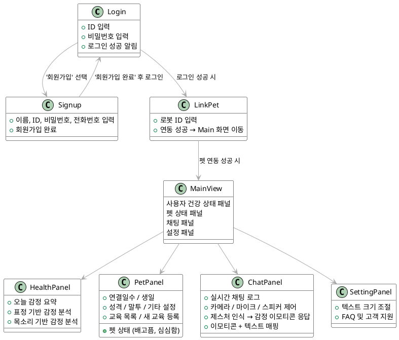

import PlantUmlDiagram from '@/components/PlantUmlDiagram';

<PlantUmlDiagram
  content={`@startuml
!define RECTANGLE class
skinparam class {
    BackgroundColor White
    BorderColor Black
    ArrowColor DarkGray
}

RECTANGLE Login {
  + ID 입력
  + 비밀번호 입력
  + 로그인 성공 알림
}

RECTANGLE Signup {
  + 이름, ID, 비밀번호, 전화번호 입력
  + 회원가입 완료
}

RECTANGLE LinkPet {
  + 로봇 ID 입력
  + 연동 성공 → Main 화면 이동
}

RECTANGLE MainView {
  사용자 건강 상태 패널
  펫 상태 패널
  채팅 패널
  설정 패널
}

RECTANGLE HealthPanel {
  + 오늘 감정 요약
  + 표정 기반 감정 분석
  + 목소리 기반 감정 분석
}

RECTANGLE PetPanel {
  + 펫 상태 (배고픔, 심심함)
  + 연결일수 · 생일
  + 성격 · 말투 · 기타 설정
  + 교육 목록 · 새 교육 등록
}

RECTANGLE ChatPanel {
  + 실시간 채팅 로그
  + 카메라 · 마이크 · 스피커 제어
  + 제스처 인식 → 감정 이모티콘 응답
  + 이모티콘 + 텍스트 매핑
}

RECTANGLE SettingPanel {
  + 텍스트 크기 조절
  + FAQ 및 고객 지원
}

Login --> Signup : '회원가입' 선택
Signup --> Login : '회원가입 완료' 후 로그인

Login --> LinkPet : 로그인 성공 시
LinkPet --> MainView : 펫 연동 성공 시

MainView --> HealthPanel
MainView --> PetPanel
MainView --> ChatPanel
MainView --> SettingPanel
@enduml`}
/>

  
PlantUML 코드 보기

# 화면 구성 및 동작 명세서

---

## 로그인 화면 (LoginView)

### 입력 필드
- **ID (이메일)** 입력  
- **비밀번호** 입력

### 동작
- **로그인 버튼 클릭 시:** 서버에 인증 요청  
- **로그인 성공 시:** `"로그인 되었습니다"` 알림 표시 후 다음 화면으로 이동

---

## 회원가입 화면 (SignupDialog)

### 입력 필드
- 이름  
- ID (이메일)  
- 비밀번호  
- 전화번호  

### 동작
- **회원가입 완료 시:** 성공 알림 표시 → 로그인 화면으로 복귀

---

## 사용자 메인 화면 (MainView + Tabs)

---

### 1. 사용자 건강 상태 패널 (UserStatusPanel)

#### 실시간 분석
- 표정에서 감지된 기분을 분석하여 **텍스트로 표시**
- 음성에서 감지된 기분을 분석하여 **텍스트로 표시**

---

### 2. 펫 상태 패널 (PetPanel)

#### 기본 설정
- 성격: 발랄함 · 시크함 · 내향적 · 외향적  
  → *MBTI 방식 고려 중*  
- 말투: 반말 · 존댓말 · 음슴체  
- 기타 설정 텍스트 필드  
  - 예: `"서울시 금천구 기준으로 장소 알려줘"`, `"땅콩 알레르기 있음"`

#### 교육 기능
- **새로 교육하기**
  - 행동 입력  
  - 매칭 텍스트 입력 (**필수**)  
  - 매칭 카메라 제스처 (**선택**)  
  - 저장 버튼 클릭 시 DB에 저장
- **기존 교육 목록 확인 가능**

---

### 3. 채팅 패널 (ChatPanel)

#### 기본 기능
- **실시간 채팅**: 항상 백그라운드에서도 유지  
- **기존 대화 내역**: 스크롤을 통해 확인 가능  

#### 기기 제어
- **카메라 ON·OFF**: 사용자 제어 가능  
- **마이크 ON·OFF**: STT(Whisper 기반) 활성화  

#### 채팅 로그
- STT·TTS 여부와 관계없이  
  → **텍스트는 항상 대화창에 표시됨**

---

### 4. 설정 패널 (SettingPanel)

#### 텍스트 크기 조절
- 시각 약자를 고려한 **가변 크기 설정 기능**

#### 저장 기능
- 설정 저장 시 서버에 적용 (사용자별 UI 환경 유지)
